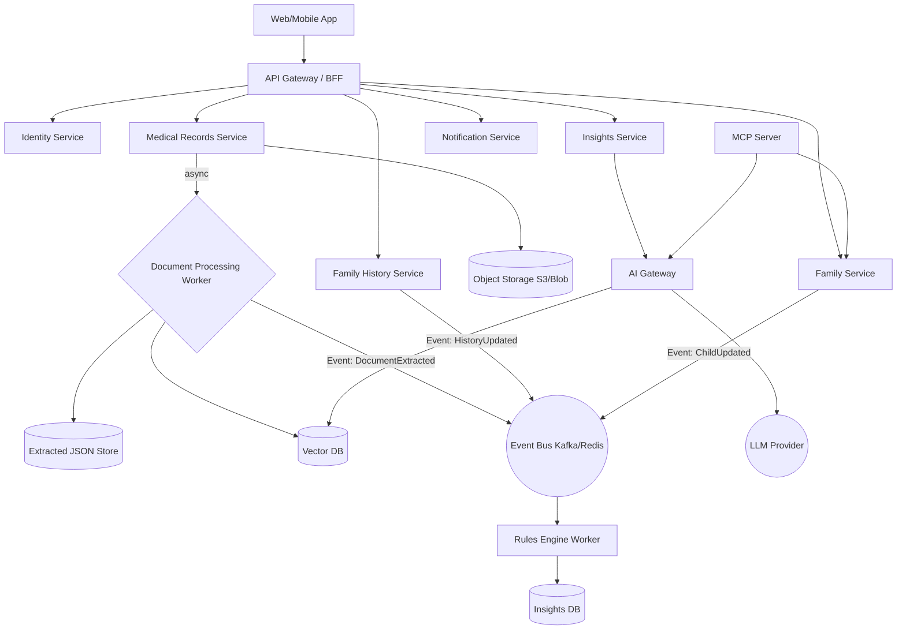
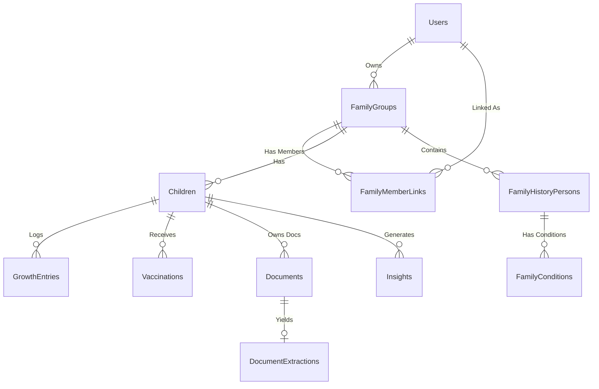

# KidoDoc

**KidoDoc** is a privacy-first pediatric health assistant designed to empower parents with an AI-driven, secure, and structured way to manage their children's health records, family history, and growth metrics. 

By analyzing medical documents and combining them with deep family history contexts, KidoDoc generates explainable health insights, predicts risks, and provides actionable preventive recommendations.

## 🌟 Vision & Key Outcomes

- **Onboarding & Management**: Register as parents, add partners, manage up to 4 children, and capture comprehensive family medical history (maternal, paternal, siblings) in under 10 minutes.
- **Document Intelligence**: Upload and automatically organize medical documents (blood reports, scans, prescriptions, genetic reports, growth charts) with OCR and LLM extraction.
- **AI Health Insights**: Receive actionable preventive recommendations, vaccination reminders, risk alerts, and growth milestone tracking based on combined structured data and analyzed documents.
- **Security & Sharing**: HIPAA-grade security, data minimization, and secure sharing capabilities for clinicians or family members, backed by an MCP (Model Context Protocol) Server for future AI ecosystem integrations.

## 👤 Personas & Roles

- **Parent**: Primary Account Owner (Full access).
- **Partner**: Secondary Account (Full access, cannot delete family group).
- **Family Member**: Invite-only (View-only or limited contributor).
- **Clinician**: Invite-only (View medical summary, download reports, add notes).
- **Admin**: Platform Admin (Support & audit tools).

---

## 🏗️ Architecture & High-Level Design (HLD)

KidoDoc is built on a **Microservices + Event-Driven** architecture to ensure bounded contexts for PHI data, scalability for heavy AI/document processing workloads, and loose coupling.

### System Architecture Diagram


### Core Services

1. **Identity Object Service**: Manages OAuth (Gmail), OTP handling, sessions, and RBAC/ABAC.
2. **Family Service**: Manages Family Groups, roles, and child profile logging (growth/vaccinations).
3. **Family History Service**: Maps maternal/paternal trees, recording conditions, and computing deterministic risk scores.
4. **Medical Records Service**: Handles document uploads, metadata tracking, and categorization.
5. **Document Processing Worker**: Async worker that performs OCR, chunks document text, runs vector embeddings, and stores structured values in DB.
6. **Insights Service**: Event listener that triggers rules/AI evaluation for inferences (e.g., vaccination due dates).
7. **AI Gateway & MCP**: Orchestrates LLM prompt templates, RAG integration, enforces safety guardrails, and provides secure external access.

---

## ⚙️ Low-Level Design (LLD)

### Database Entity-Relationship Diagram (ERD)


### Async Event Bus Examples

**1. `DocumentUploadedEvent`**
Triggered when a medical record is successfully uploaded to blob storage.
```json
{
  "eventId": "uuid",
  "eventType": "DocumentUploaded",
  "data": {
    "docId": "uuid",
    "childId": "uuid",
    "fileUri": "s3://...",
    "mimeType": "application/pdf"
  }
}
```

**2. `DocumentExtractedEvent`**
Triggered after async extraction and mapping of the text and insights payload by the worker.
```json
{
  "eventId": "uuid",
  "eventType": "DocumentExtracted",
  "data": {
    "docId": "uuid",
    "childId": "uuid",
    "summary": "Blood test showing slightly elevated HbA1c",
    "structuredValues": { "HbA1c": 6.1 }
  }
}
```

### Core API Contracts

* **Auth**: `POST /api/v1/auth/otp/request` & `/verify`
* **Family Management**: `POST /api/v1/family/children`, `GET /api/v1/family/children`
* **History**: `POST /api/v1/family-history/person/{id}/conditions`
* **Documents**: `POST /api/v1/documents/upload`
* **Insights**: `GET /api/v1/insights?child_id={id}` (Returns type, severity, reason, and suggested actions)

---

## 🧠 AI & Vector RAG Strategy

We employ a Retrieval-Augmented Generation (RAG) pattern coupled with strict LLM guardrails (no direct diagnosis or prescription) utilizing a partitioned Vector DB.

**Vector DB Schema Strategy**:
- `child_id`: Mandatory partition key for multi-tenant isolation.
- `chunk_type`: Filters by categories like `lab_panel`, `clinical_note`.
- **System Prompt Guardrails**: 
  - ALWAYS state when a pediatrician consultation is recommended.
  - DO NOT diagnose.
  - Output strict JSON formats defining Insight Types (`FAMILY_RISK_ALERT`, `GROWTH`, `VACCINATION`).

---

## 🛠️ Technology Stack

- **Frontend**: React, TypeScript, Material UI / Tailwind CSS, React Query
- **Backend**: Node.js (NestJS / Express) or Go 
- **Database**: PostgreSQL (Transactional storage) & pgvector / Pinecone (Vector database for embeddings)
- **Object Storage**: AWS S3 or Azure Blob Storage
- **Caching & Message Broker**: Redis / Kafka
- **AI/LLM Provider**: Azure OpenAI (HIPAA Compliant) or AWS Bedrock
- **Security Protocols**: AES-256 for data-at-rest, TLS 1.2+ in transit, Strict RBAC

---

*Documentation auto-generated from KidoDoc Planning definitions.*