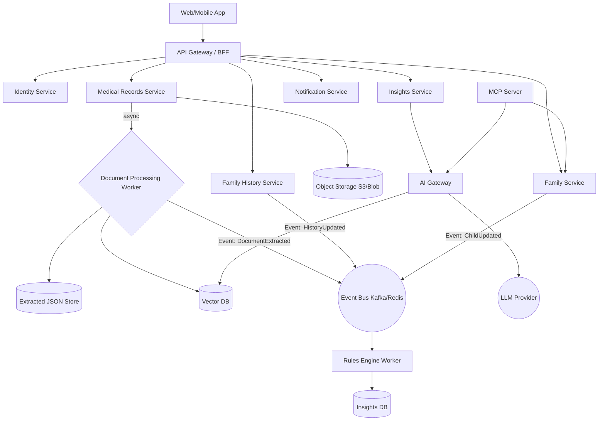

# High-Level Design (HLD): KidoDoc

## 1. Architecture Style
KidoDoc utilizes a **Microservices + Event-Driven** architecture. This ensures bounded contexts for sensitive PHI data, scalability for document processing (OCR/Embeddings), and loose coupling for AI integration.

## 2. System Architecture Diagram

## 3. Core Services (Bounded Contexts)

### Identity Service
**Responsibilities**: OAuth integration (Gmail), OTP handling, session management, token issuance, RBAC/ABAC policy evaluation.
**Data Store**: PostgreSQL (User tables).

### Family Service
**Responsibilities**: Managing Family Group, Owner vs Partner roles, Child profile management (growth entries, vaccinations).
**Data Store**: PostgreSQL.

### Family History Service
**Responsibilities**: Managing maternal/paternal/sibling trees and recorded conditions. Computing deterministic risk scores.
**Data Store**: PostgreSQL.

### Medical Records Service
**Responsibilities**: Handling document uploads, metadata management, auto-categorization, querying document metadata.
**Data Store**: PostgreSQL (metadata) + Object Storage (raw files).

### Document Processing Worker (Async)
**Responsibilities**: Consuming document upload events to perform OCR, structured value extraction, text chunking, and vector embedding generation.
**Data Store**: Extracted JSON Store + Vector DB (pgvector/Pinecone/Weaviate).

### Insights Service
**Responsibilities**: Surfacing actionable health insights. Listens to events to trigger rules engine (e.g., vaccination due date calculation) or AI Orchestrator for complex inferences.
**Data Store**: PostgreSQL.

### AI Gateway Service
**Responsibilities**: Orchestrating LLM interactions, RAG retrieval logic, guardrail enforcement (no diagnosis), and prompt templating.

### MCP (Model Context Protocol) Server
**Responsibilities**: Exposing tools securely (with consent gates/redaction modes) for authorized external LLM clients.

## 4. Key Event Flows

### Document Processing Flow
1. User uploads document $\rightarrow$ `Medical Records Service` stores file in S3 and saves DB record.
2. Emits `DocumentUploadedEvent`.
3. `Document Processing Worker` picks up event, extracts text/data, chunks text, and creates embeddings.
4. Stores vectors in `Vector DB` and structured data in DB.
5. Emits `DocumentExtractedEvent`.
6. `Insights Service` listens, triggers AI evaluation to generate new insights for the child.

### Family History Update Flow
1. User adds Heart Disease to Maternal Grandfather $\rightarrow$ `Family History Service` updates DB.
2. Emits `FamilyHistoryUpdatedEvent`.
3. `Rules Engine Worker` evaluates deterministic risks. Updates risk flags.
4. Emits `InsightGeneratedEvent` (e.g., "Consider Cardiovascular Screening").
5. `Notification Service` pushes alert to UI.

## 5. Technology Stack Recommendations
- **Frontend**: React + TypeScript + Material UI (React Query for state).
- **Backend API**: Node.js (NestJS or Express/Fastify) or Go.
- **Transactional Database**: PostgreSQL.
- **Vector Database**: pgvector (easiest starting point within Postgres) or Pinecone.
- **Cache/Events**: Redis.
- **Storage**: AWS S3 or Azure Blob Storage.
- **LLM Provider**: Azure OpenAI (HIPAA compliant) or AWS Bedrock.
