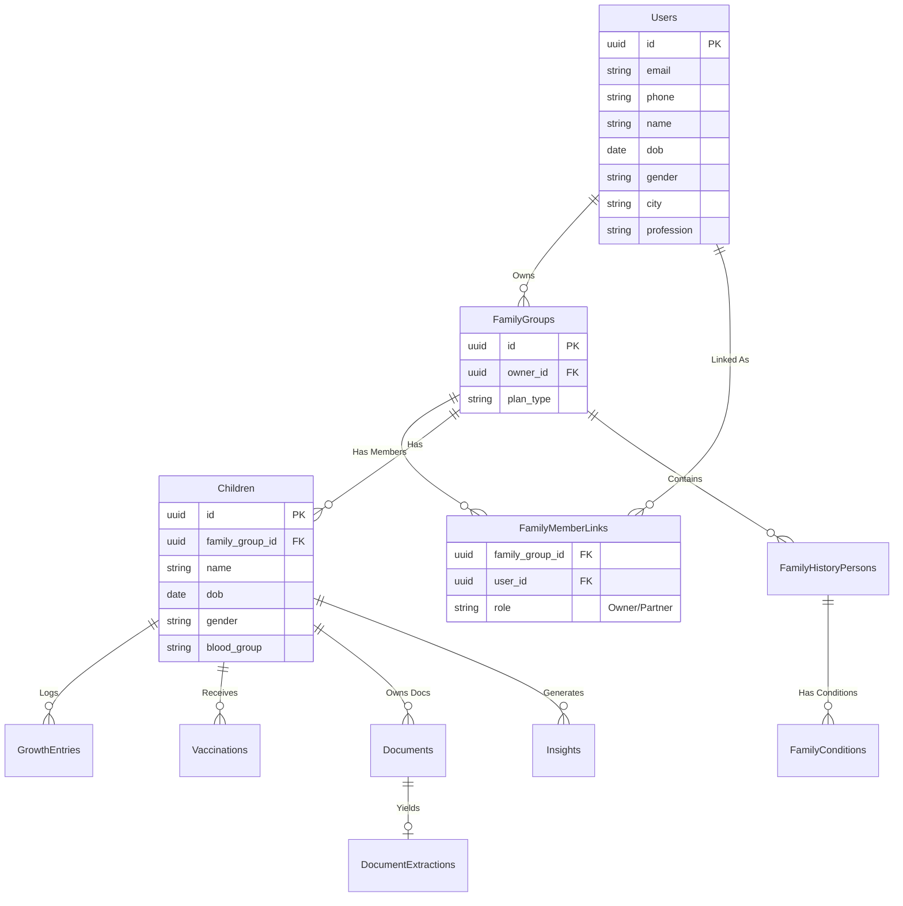

# Low-Level Design (LLD): KidoDoc

## 1. Database Entity-Relationship Diagram (ERD)



## 2. API Contracts (Subset)

### Identity & Auth
- `POST /api/v1/auth/otp/request` 
  - Body: `{ phone: string }`
- `POST /api/v1/auth/otp/verify`
  - Body: `{ phone: string, otp: string }`
  - Returns: `{ token: string, user: object }`

### Family Management
- `POST /api/v1/family/children`
  - Body: `{ name: string, dob: string, gender: string, blood_group?: string }`
- `GET /api/v1/family/children`
  - Returns: `List<Child>`

### Family History
- `POST /api/v1/family-history/person`
  - Body: `{ relationship: string, age_range: string, gender: string }`
- `POST /api/v1/family-history/person/{id}/conditions`
  - Body: `{ condition_code: string, severity?: string }`

### Medical Records
- `POST /api/v1/documents/upload`
  - Form-Data: `file`, `child_id`, `category` (optional)
  - Returns: `{ doc_id: string, status: "PROCESSING" }`
- `GET /api/v1/documents?child_id={id}`
  - Returns: `List<DocumentMetadata>`

### Insights
- `GET /api/v1/insights?child_id={id}`
  - Returns: `List<InsightCard>`
  - Structure: `{ type, severity, title, why, actions: [{type, label}] }`

## 3. Event Schemas (Async Bus)

### `DocumentUploadedEvent`
```json
{
  "eventId": "uuid",
  "eventType": "DocumentUploaded",
  "timestamp": "ISO8601",
  "data": {
    "docId": "uuid",
    "childId": "uuid",
    "fileUri": "s3://...",
    "mimeType": "application/pdf"
  }
}
```

### `DocumentExtractedEvent`
```json
{
  "eventId": "uuid",
  "eventType": "DocumentExtracted",
  "timestamp": "ISO8601",
  "data": {
    "docId": "uuid",
    "childId": "uuid",
    "summary": "Blood test showing slightly elevated HbA1c",
    "structuredValues": { "HbA1c": 6.1 }
  }
}
```

## 4. Prompt Templates & Guards

### System Prompt (Insights Orchestrator)
```text
You are KidoDoc, a strict, privacy-first pediatric health assistant.
You analyze provided medical documents, family history, and growth metrics.
GUARDRAILS:
1. DO NOT diagnose any conditions.
2. DO NOT prescribe medications.
3. ALWAYS state when a pediatrician consultation is recommended.
4. ONLY return results in the exact JSON format specified.

OUTPUT SCHEMA:
{
  "insights": [
    {
      "type": "FAMILY_RISK_ALERT" | "VACCINATION" | "GROWTH" | "DOCUMENT_SUMMARY",
      "severity": "LOW" | "MEDIUM" | "HIGH",
      "title": "string",
      "why": "string (explainable reason)",
      "data_used": ["string paths"],
      "actions": [{"type": "SCHEDULE" | "LEARN_MORE", "label": "string"}]
    }
  ]
}
```

## 5. RAG Strategy (Vector DB schema)
**Table/Collection Strategy**:
- `id`: unique chunk ID
- `child_id`: Partition key for multi-tenant isolation.
- `doc_id`: Relates to source document.
- `chunk_type`: `lab_panel`, `clinical_note`, `prescription`.
- `embedding`: 1536-dim vector (e.g. text-embedding-ada-002).
- `text`: Raw chunk string.
- Retrieval filter MUST include `child_id = :current_child`.
